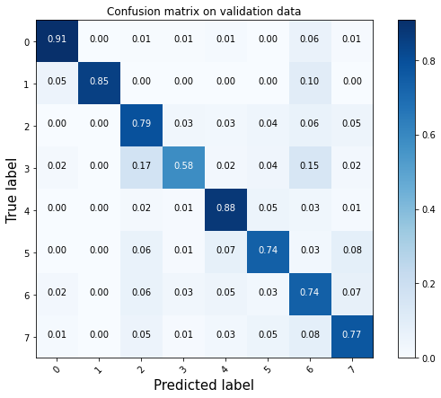
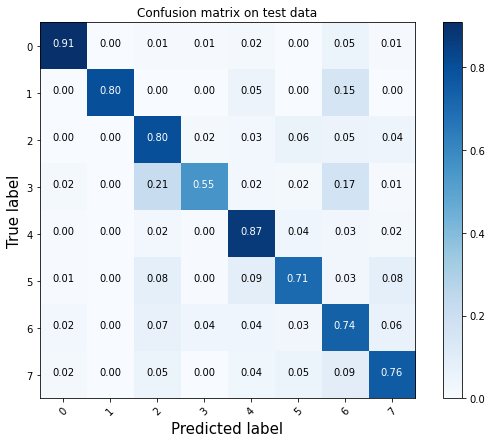
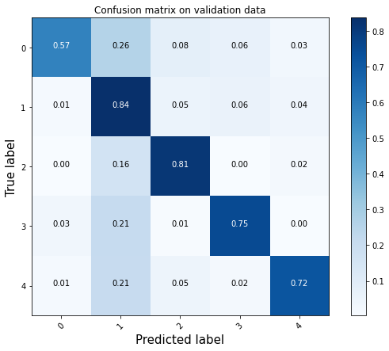
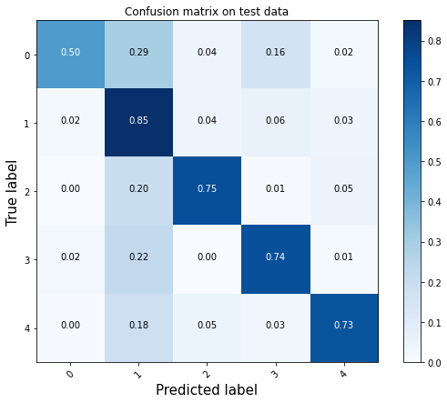

# Clasificación Taxonómica de Eventos de Ocio con DistilBERT

## Proyecto Fin de Máster

*Máster en Machine Learning, Deep Learning e Inteligencia Artifical por Big Data International Campus en colaboración con
la UCAM*

**Autor**: Bernardo García del Río

**Director**: Miguel Camacho

Este repositorio acompaña a la memoria presentada para el proyecto fin de máster donde se explica detalladamente todo
el proceso de preparación de datos, entrenamiento y evaluación del modelo y despliegue del modelo. Además, también
se explica la razón de ciertas decisiones que se tomaron durante el proyecto. La memoria puede descargarse en el
siguiente enlace:

https://drive.google.com/drive/folders/1hmu_BwEQtaYrqGJsh96pzNNgFhmuNdzG?usp=sharing

## Objetivo
_______
El objetivo de este proyecto fin de máster es construir un clasificador de taxonomías, es decir, un modelo que procese la
descripción de un evento usando técnicas de procesamiento del lenguaje natural y lo clasifique por taxonomía y
sub-taxonomías.

Para ello se utilizó el modelo de estado del arte `DistilBERT`.

El clasificador de taxonomias se desplegó utilizando la nueva herramienta para poner modelos de `Pytorch` en producción
`TorchServe`.

## Datos
_______
Los datos utilizados para el entrenamiento son propiedad de Smartvel y, por lo tanto, no se han subido al repositorio
público.

Se trata de un dataset de cerca de 60000 ejemplos de eventos con titulo, descripción, taxonomía y subtaxonomía.

Para el entrenamiento y evaluación, se particionaron los datos siguiendo las siguientes proporciones:

- 70% Entrenamiento
- 15% Validación
- 15% Testeo

## Modelos
________
Los pesos de los modelos entrenados pueden descargarse en el siguiente enlace:

https://drive.google.com/drive/folders/1LOnXoH2iCOBtD9of17uqa4PTFTQ2h9eX?usp=sharing

## Resultados
_________
El clasificador de taxonomías consiguió una accuracy de **79.4%** en el conjunto de validación y **78.8%** en el
conjunto de testeo. Matrices de confusión:

El clasificador de subtaxonomías para la taxonomía 173 consiguió una accuracy del **78.7%** en el conjunto de
validación y **77.9%** en el conjunto de testeo. Matrices de confusión:

## Despliegue con TorchServe
_________
Se implementó el despliegue en producción del modelo clasificador de taxonomías con `TorchServe`.

[Despliegue con TorchServe](TorchServe/)

## Entorno Virtual
_______
Para el proyecto se crearon dos entornos virtuales a partir de la distribución anaconda, uno para el desarrollo y 
otro para el despliegue con torchserve. Para la reproducción de resultados, el entorno virtual se puede instalar
a partir de las siguientes líneas de código:

- macOS:

`$ conda create --name taxonomy_distilbert --file requirements_distilbert.txt`

- Windows o Linux:

`$ conda env create -f environment_distilbert.yml`